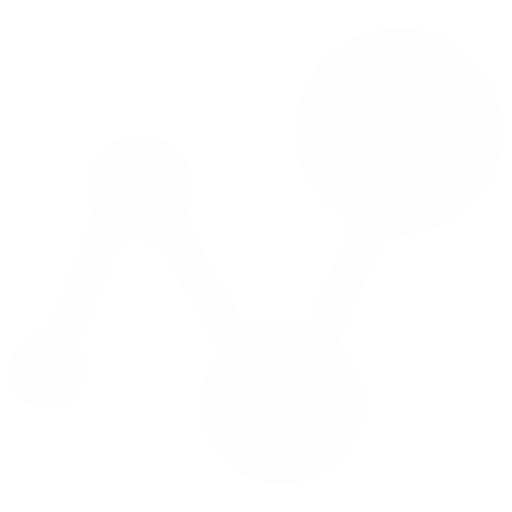

<h1 style="display: flex; align-items: center; gap: 10px;">
  
  UBXView
</h1>

*Model and stream real-time kinematic (RTK) drone-mounted sensors for radar calibration workflows, powered by u-center.* 

> [Rust](https://www.rust-lang.org/) - Backend, Tauri .exe compiler 
> [Node.js](https://nodejs.org/) - three.js, I/O 
> [xyzservices](https://pypi.org/project/xyzservices/) - Satellite images  
> [u-center](https://www.u-blox.com/en/product/u-center) - GPS utility 

